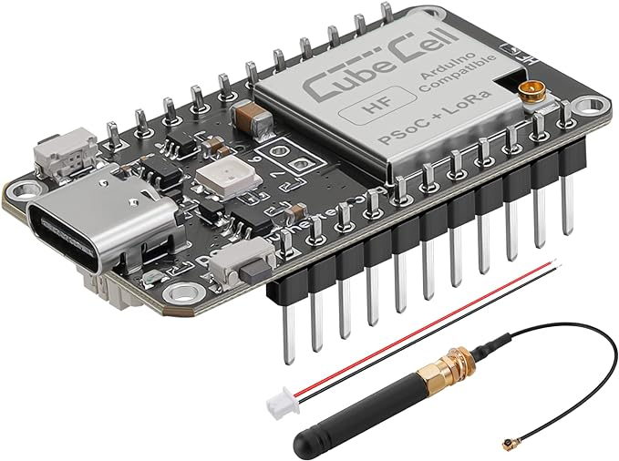
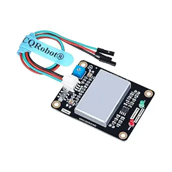
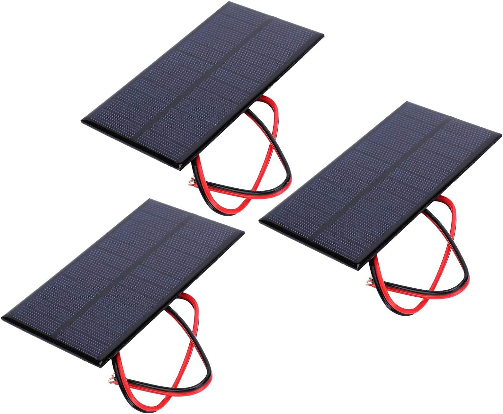
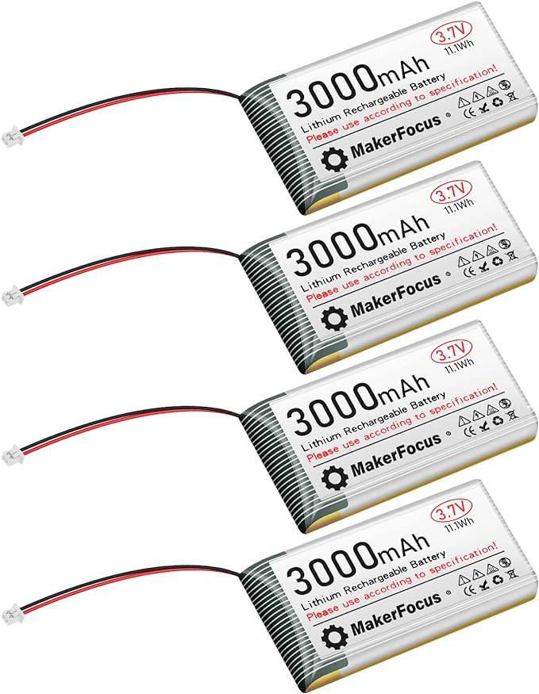

# Parts Used

## CubeCell Board

Amazon link: https://www.amazon.com/MakerFocus-LoRaWAN-Development-Consumption-Intelligent/dp/B07ZHCMFW4/ref=sr_1_4?keywords=cubecell%2Blora%2Bboard&sr=8-4&th=1

## Microwave Sensor

Amazon link: https://www.amazon.com/CQRobot-10-525GHz-Microwave-Compatible-Measurement/dp/B089NKGWQQ/ref=sr_1_1?keywords=ocean%2Bmicrowave%2Bsensor&sr=8-1&th=1

## Solar Panel

Amazon link: https://www.amazon.com/Solar-Polysilicon-Charger-Module-System/dp/B08THXDWS1/ref=psdc_2236628011_t1_B07JLFC2B1

## Battery

Amazon link: https://www.amazon.com/3000mAh-Rechargable-Protection-Insulated-Development/dp/B08T6GT7DV/ref=d_pd_sim_sccl_3_4/142-7084046-6698207?pd_rd_i=B08T6GT7DV&th=1