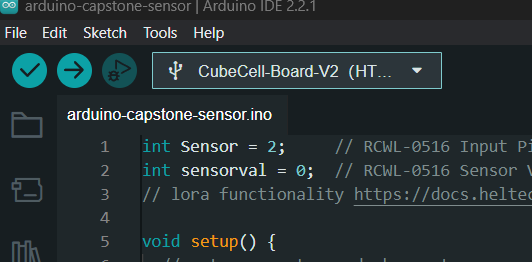

# How to set up

Thorough documentation about the CubeCell board can be found here: https://docs.heltec.org/en/node/asr650x/htcc_ab02/quick_start.html

Example code and Libraries for the device can be found here: https://github.com/HelTecAutomation/CubeCell-Arduino/tree/master

## Step 1 Configure Environment

Install Arduino IDE and open it (https://www.arduino.cc/en/software)

Configure Arduino IDE Board Manager to work with CubeCell Board by clicking File > Preferences > Settings

Input following json url to Additional Board Manager URLs:

https://github.com/HelTecAutomation/CubeCell-Arduino/releases/download/V1.5.0/package_CubeCell_index.json

Then, Click Tools > Board > Boards Manager, search 'Heltec CubeCell' in the new pop-up dialog, select the latest releases and click install

## Step 2 Push Code to the Device
Copy the code from this repo called test-environment.ino and paste its contents into your working file.

Select your board in the drop down menu

Then click the arrow pointing to the right to upload the code to the device.

## Step 3 Ensure Device is Functioning
Open up the serial monitor in the Arduino IDE by clicking Tools > Serial Monitor and set the baude rate on to 115200. If the code is running properly on the device and your serial monitor is properly configured you will see text being printed to the serial monitor such as the image below. (Don't worry about the accuracy of the data as we have not connected the proper sensors yet.)

## Step 4 Connect External Devices
We need to connect three devices to complete the sensor package. 

### Microwave Sensor
Additional data on the microwave sensor can be found here:
http://www.cqrobot.wiki/index.php/10.525GHz_Doppler_Effect_Microwave_Motion_Sensor_SKU:_CQRSENWB01

Ensure that the voltage switch is set to 3.3V instead of 5V

Connect the Microwave sensor by connecting the green wire to the 5 pin on the CubeCell board. 

Connect the red wire to the 3.3V pin on the CubeCell board

Connect the black wire to a GND pin on the CubeCell board

For information on pins on the CubeCell board refer to this link:
https://github.com/HelTecAutomation/CubeCell-Arduino/blob/master/PinoutDiagram/HTCC-AB01.pdf

### Solar Connections

Connect the red solar panel wire to the VS pin on the CubeCell board

Connect the black solar panel wire to the GND pin on the CubeCell board

Cubecell solar documentation: https://docs.heltec.org/en/node/asr650x/htcc_ab02/solar_panel.html

### Battery Connector

Connect the battery to the battery connector on the CubeCell board.

### Reset Button
Reset the board by pressing the RST button on the CubeCell board.

## Final Product
Your device should look something like this when it has been properly assembled

