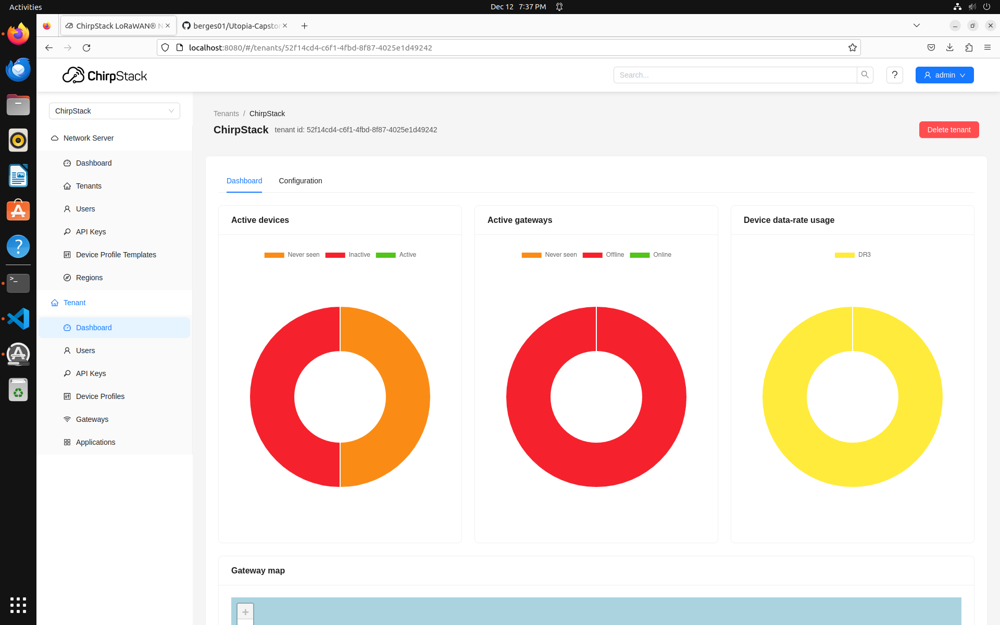
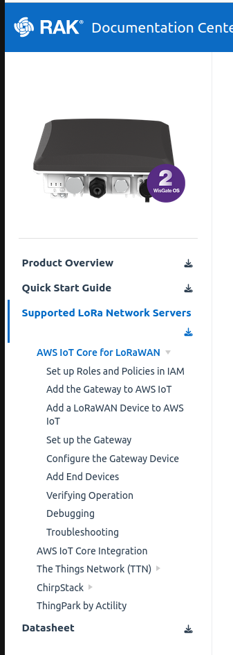
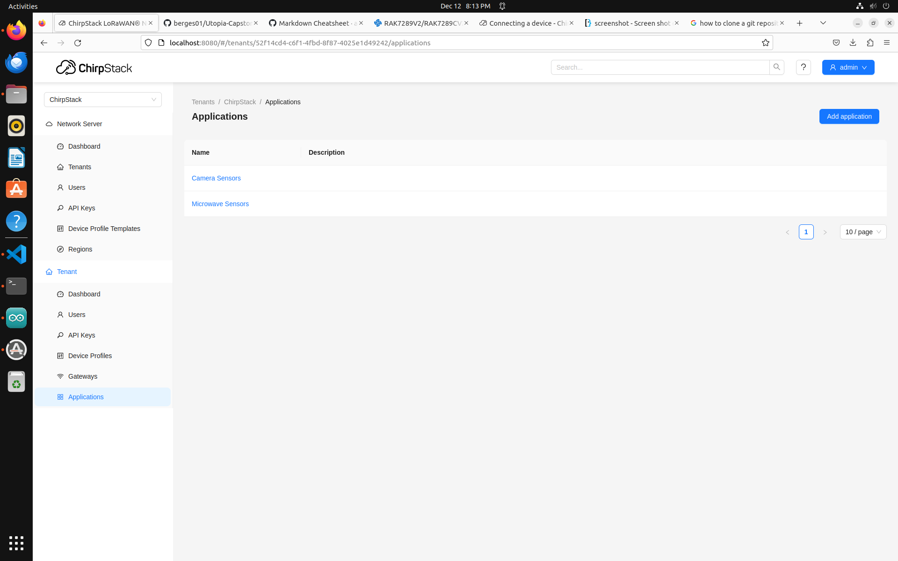
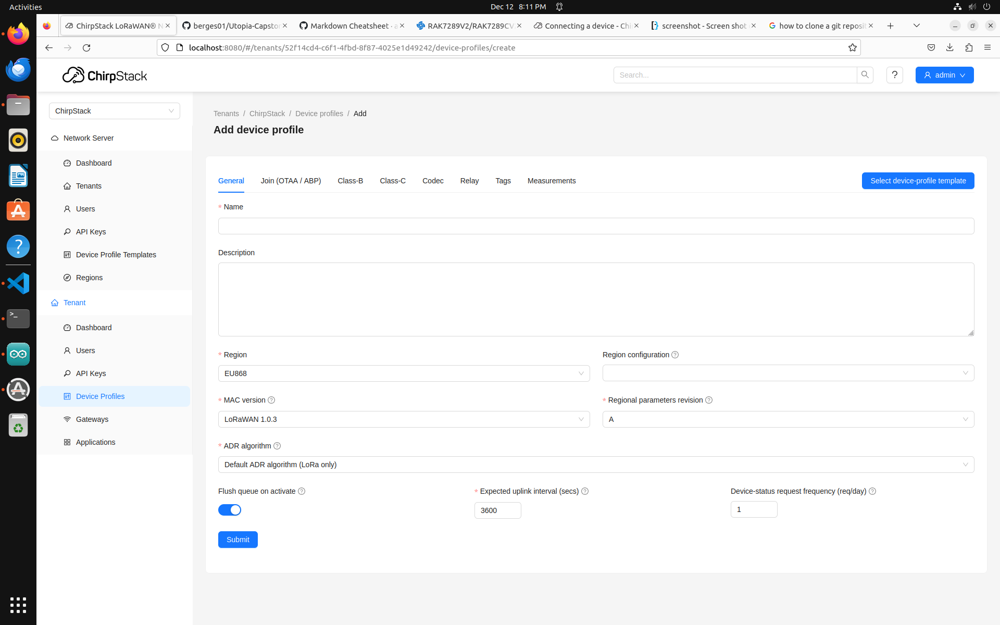
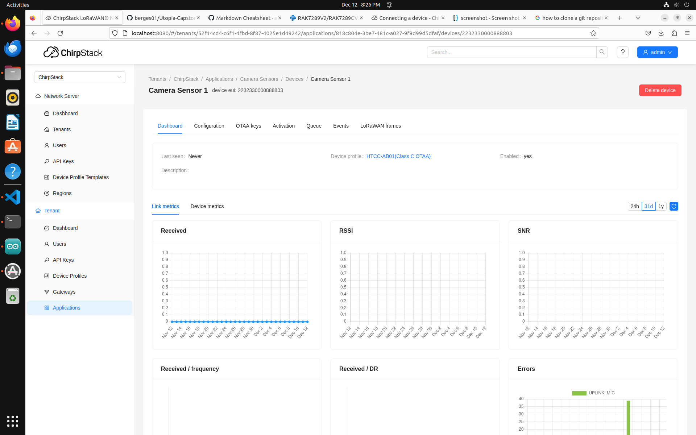
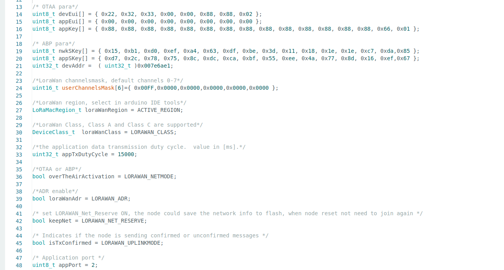

# Chirpstack Setup with LoRaWAN
This will guide you through setting up Chirpstack with LoRaWAN. Refer to the sections below for specifics on different parts of the network. The version used in this documentation is Chirpstack v4. 
## Network Server
The network server will manage all of end node devices and gateways that forward their packets. 
### Setup
A few preliminary things to note before setting up. 
* Make sure your gateway can ping your network server (If not, configure the network to allow this.)
* Using PoE will make this easier to set up. 
* Pick an end-node device that is capable with Chirpstacks network server. Only devices that are compatible with Chirpstack will be in scope, all other devices will be considered out of scope. 
[Link](https://github.com/TheThingsNetwork/lorawan-devices) to 
Chirpstack compatible devices

Follow this guide for installing the network server: [Chirpstack Installation](https://www.chirpstack.io/docs/getting-started/debian-ubuntu.html)

After you have installed Chirpstack, you should have a dashboard similar to the following. (There will not be any active devices or gateways) To access it, head to it at https://localhost:8080



After you have installed chirpstack, import the device repo using this command in your local terminal:
```
git clone https://github.com/brocaar/lorawan-devices /tmp/lorawan-devices
chirpstack -c /etc/chirpstack import-ttn-lorawan-devices -d /tmp/lorawan-devices
```
NOTE: You will need to run the above command in the chirpstack installation directory located at /etc/chirpstack. You will need to access this directory as root in order to access it, but also to make changes. ```sudo su```

Connect the gateway. (Refer to the section below)
## Gateway
The gateway used in our setup is the [RAK 7289V2](https://store.rakwireless.com/products/rak7289-8-16-channel-outdoor-lorawan-gateway?variant=41806809661638). Using multiple antennas will allow for more channels, and for more devices to be connected. Please refer to the link below for setting up the gateway. Connect to the gateways Wi-Fi network and set it up following the instructions in the quick start guide. 
[RAK Documentation](https://docs.rakwireless.com/Product-Categories/WisGate/RAK7289-V2/Quickstart/#prerequisites "RAK Quick Start Guide")

You will see how to configure the gateway with chirpstack in the Supported Network Servers section. 



Once you have configured the gateway, and pointed it to the network servers IP address, it should connect automatically to the network server and you should see it is seen by the network server as a registered gateway. 
## End-node Device
Use this [link](https://www.chirpstack.io/docs/guides/connect-device.html) to understand how to connect a device to the network server. 

The easiest method is to use OTAA (Over the Air Authentication). This will eliminate the need for a Join Server, and manual configuration of the uplink and downlink. ABP (Activation By Personalization) can be used to customize the connection further, but is considered less secure. 

1. Start by clicking on the section titled Applications. 

2. Create a new application. 
3. Give it a name that relates to what the sensor you are trying to connect does. 
4. Once you have created an application add a new device to the application. Follow the steps below to import device profile templates to make end-node configuration simpler. 
5. Import the device profile template that matches your device in the Device Profiles page. Then select the "Select Device-Profile Template" button. 

6. Choose your device from the dropdown. 
7. Verify that the information is correct, and click submit.
8. Now head back to your new device application and add the device profile template you created. Ensure the information in Chirpstack matches what you will configure in your Arduino code. 
9. Once you have configured the settings of how to connect your device, it should connect automatically after correct Arduino code has been pushed. 
NOTE: Use the LoRaWAN Frames menu located in the end-node device menu that will be created after the device has been created. 


### Arduino Code
Import your device into Arduino by selecting Tools->Board->Board Manager. Search for your device and import it. Select it for use, and plug it into your computer with a USB cable. Your board should be shown at the top of the IDE. You can then head to File->Examples to import code examples and start creating your configuration for your device. Once you have coded what you want, push the check mark button to compile the code. If it is successful, press the -> button to push it to your connected Arduino/LoRa Board. Ensure that your arduino code is configured to use LoRaWAN. In arduino there is a menu that allows you to configure your devices LoRaWAN setup. You should enable OTAA, (or ABP), set the region/frequency/, and other necessary variables as you need. Ensure that the device is using a devEUI, and an appKey. If you are setting up an external join server, you will need a key for that to allow the device to join. A join server is not necessary in this guide, and setting one up is out of the scope of this documentation. 



Fill out the above variables in the code by changing the values in the tools menu. All of the variables should be at the bottom of the dropdown menu. 


NOTE: After you have setup chirpstack ensure that your device is communicating on the same channel as you gateway or you may only have one way traffic. 

NOTE: If using the same device model in multiple locations, the devEUI, will be the same, the appKey should be unique when setting it up in Arduino and the Chirpstack server. 